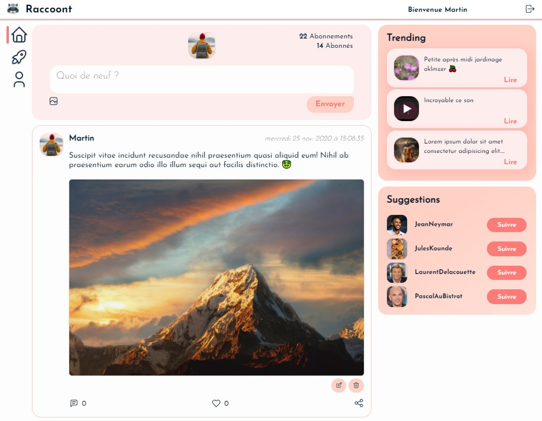

# 🚀 Javascript full-stack 🚀
## MERN Stack
### React / Express / MongoDB / Redux

Démarrer le server : `npm start`

Démarrer le front : `cd client` + `npm start`

_____________________________

### Back config :

* Mettez vos informations de cluster dans `/config/db.js`
* Créez le fichier `.env` dans `/config/` dans les données suivantes
   - PORT=5000 `votre port localhost`
   - CLIENT_URL=http://localhost:3000 `votre URL client`
   - DB_USER_PASS=fs:fromscratch `votre identifiant et mot de passe`
   - TOKEN_SECRET=990bf68e6adf1be5f1671bba3bec692056922454 `votre clé secrète aléatoire`
_________________________
  
### Front config : 
* Créez un fichier `.env` dans l'URL du serveur :
   - REACT_APP_API_URL=http://localhost:5000/ `l'url de votre serveur`
_____________________________

  
💻 Réalisé par Julien Az, novembre 2020. Libre d'utilisation
